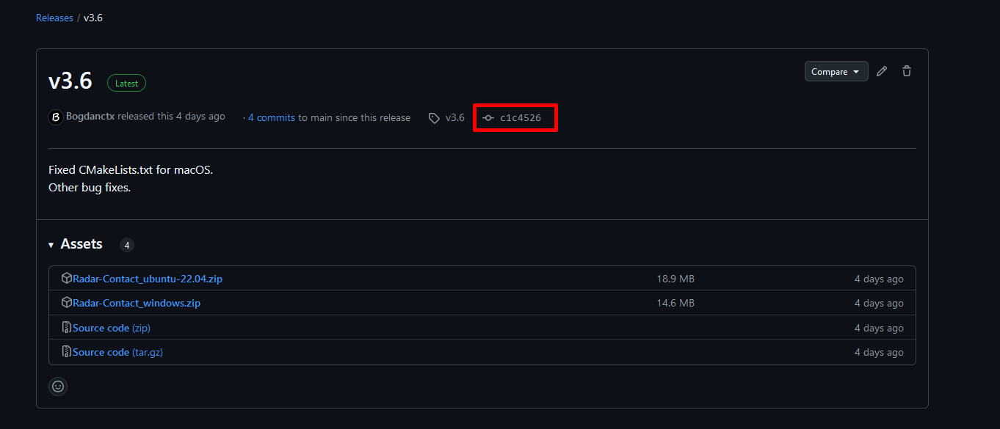

# Is it safe to run Radar Contact?

---

#### Yes, it is safe. You can check yourself the safeness by following this tutorial.

#### Verifying binaries ensures that the ``Radar-Contact_windows.zip`` and ``Radar-Contact_ubuntu-22.04.zip`` in Assets section weren't tampered in any way.

### What does this means? 
#### This means that ``Radar-Contact_ubuntu-22.04.zip`` and ``Radar-Contact_windows.zip`` have the same source code as in the commit that provided the release. That commit is available in any release and in the image below it is marked with a red rectangle. (In this case, ``v3.6`` binaries source code will match with commit ``c1c4526``. To check ``c1c4526`` source code click on it and then click ``Browse files`` on the right side of the screen).

### To do this follow the steps below.

### => Step 1: Download and install [GitHub CLI](https://cli.github.com/)
### => Step 2: Open a terminal and type ``gh auth login`` and follow the instructions (skip this step if GitHub CLI has been already configured)
### => Step 3: Open a terminal and type `gh attestation verify path_to_zip_file -R Bogdanctx/Radar-Contact`

#### Example: ``C:\Users\username\Downloads> gh attestation verify Radar-Contact_windows.zip -R Bogdanctx/Radar-Contact`` (``Radar-Contact_windows.zip`` was located in ``Downloads`` directory)

### After the verification is complete you should see <code style="color: green">Verification succeded!</code> in the terminal. This indicates that the binaries haven't been tampered and their source code matches with the commit ID that provided the release.