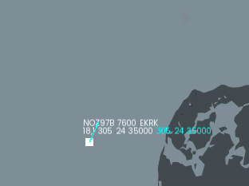

## Update [21 August 2024]

### Attention all Air Traffic Controllers!

No more freezes when downloading data.

A new requirement has been added for an airplane to land at its destination: fuel quantity must be below 10.0 tons.

Optimizations and bug fixes.

## Update [20 August 2024]

### Players, Development Tower, radar contact.

Altitude and speed can be changed using mouse scroll wheel - [#9](https://github.com/Bogdanctx/Radar-Contact/issues/9)

All requests are now made using the HTTPS protocol.

## Update [15 August 2024]

### Pan-pan, pan-pan, pan-pan!

Changed altitude and speed buttons to match description.

Radar Contact can be played in fullscreen mode.

**Radar Contact** is not available on **macOS** anymore. To play on **macOS** you have to build the project on your
system. [Installation guide](./INSTALLATION.md) may be helpful.

## Update [21 July 2024]

### Mayday, mayday, mayday!

Your job just got <b>even more demanding</b>. In addition to <b>weather
control</b>, you now need to manage <b>emergencies</b> like <b>hijacking, lost communications
or a general emergency</b>.

During a <b>hijacking, communication with the cockpit will be compromised</b>.
The airplane will <b>fly by itself, ignoring your instructions</b>, which could
lead to a <b>collision with another airplane</b>.

 

During a <b>lost communications</b> emergency, the pilots will
<b>attempt to restore contact</b> with you. This will be the <b>only time</b>
you can <b>give instructions to that airplane</b>. When contact is restored, the <b>airplane's color will turn
back to white</b>. Each time the airplane loses contact, it will be <b>marked as red</b>.

 

Additionally, airplanes and helicopters have <b>fuel consumption</b>.
You must manage them <b>efficiently and fast</b> to ensure they reach their
destination airports before they <b>run out</b>, <b>preventing a crash</b>. An airplane
will crash if speed is <b>below 140 knots</b> (the minimum speed) or <b>altitude is below 0</b> and
fuel <b>quantity is below 2.5kgs</b>. For helicopters <b>same conditions apply</b>, having <b>minimum
speed of 120 knots</b>.

When they run out of fuel, the airplane
will <b>still listen to your instructions</b>.

### <b>Good luck and stay vigilant!</b>

## Update [18 July 2024]

### Stability Fixes and quality enhancements

 <ul>
      <li>Fixed Iceland crash when playing in offline mode.</li>
      <li>Fixed a bug that caused an airplane to move faster when it was repeatedly clicked on in flight table.</li>
      <li>Fixed airplanes callsign position.</li>
      <li>Fix for Cyprus air traffic.</li>
      <li>Added icon for game window.</li>
      <li>Removed console for Windows users.</li>
      <li>Lowered volume of loading screen and ATC voice.</li>
      <li>Other minor changes and optimizations.</li>
  </ul>

## Update [17 July 2024]

### Attention all Air Traffic Controllers!

From now on, your job just got even more realistic with <b>real air traffic integration</b>,
thanks to <b>[AIRPLANES.LIVE](https://airplanes.live/get-started/)</b>.

## Update [13 July 2024]

### Ladies and gentlemen, fasten your seatbelts!

Your job as an ATC just got tougher. Control airplanes to ensure they avoid storms.
Once inside bad weather, airplanes will rapidly lose altitude, their airspeed will decrease, and their heading will become unstable.

## Update [9 July 2024]

### Routes!
To create a route for a flying entity, click on the flying entity, then press <b>Space</b> on any waypoint
available on the map to add it to the current route. To reset the route, change the heading.

