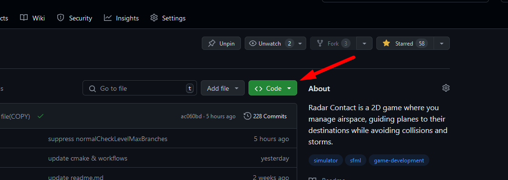
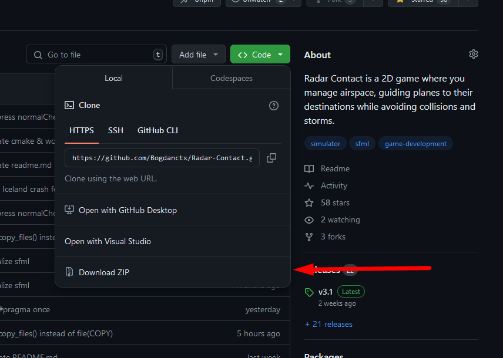
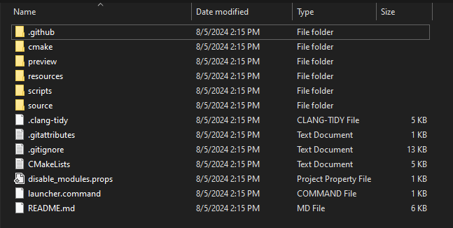
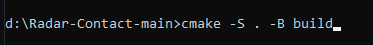
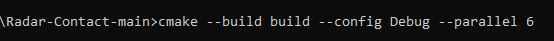
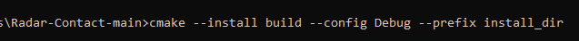
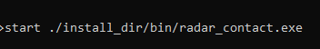

# Installation guide

### Prerequisites
#### CMake version must be at least 3.26

# Windows

### Step 1

Download the source code as ZIP from [here](https://github.com/Bogdanctx/Radar-Contact) by presing the
green button marked in the image below.

### Step 2

Press <b>Download ZIP</b> button and then extract the content.

### Step 3

Go inside the extracted folder (the folder name should be Radar-Contact-main)

### Step 4

Open your OS terminal inside the extracted folder and type following 
command: <b>cmake -S . -B build</b>. Then wait until the whole
process is finished (it may take a while).

### Step 5

After the previous step finished type the following command 
inside terminal: <b>cmake --build build --config Debug -parallel 6</b> (could be any number; --parallel X means the number of
cores to be used to build the project, this is used to make the process faster).

### Step 6

Install the project using this command: <b>cmake --install build --config Debug --prefix install_dir</b>

### Step 7

Finally, run the game using <b>start ./install_dir/bin/radar_contact.exe</b>

