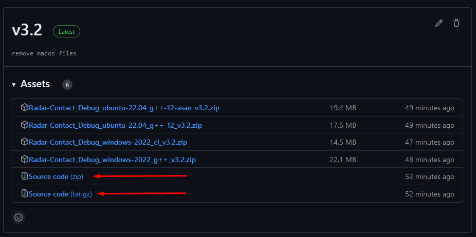

# Installation guide

### Prerequisites
#### => [CMake](https://cmake.org/) version at least 3.26.

### Step 1

Press on the latest release available.


### Step 2

Download the source code as **.zip** or **.tar.gz** from [here](https://github.com/Bogdanctx/Radar-Contact/releases) by pressing on one of the last 2 archieves available in the latest release.



### Step 3

Go inside the extracted folder.


### Step 4

Open your OS terminal inside the extracted folder and type: ```cmake -S . -B build```. Then wait until the whole
process is finished (it may take a while).


### Step 5

Type in terminal: ```cmake --build build -j6``` (```-j6``` is the number of
threads used to build the project - this is used to make the process faster).


### Step 6

Install the build with this command: ```cmake --install build```.


### Step 7

The app can be found in this directory: ```install_dir/bin```.

To run the game on <b>Windows</b> use ```start ./install_dir/bin/radar_contact.exe``` <br>

<br><br>
To run the game on <b>Linux</b> use ```./install_dir/bin/radar_contact``` <br>


### Common errors on Linux

1) ```./radar_contact: error while loading shared libraries: libasan.so.8: cannot open shared object file: No such file or directory```

Make sure to have GCC-12 installed. Install GCC-12 using ```sudo apt-get install gcc-12```.


2) ```./radar_contact: error while loading shared libraries: libopenal.so.1: cannot open shared object file: No such file or directory```

Make sure that you have these libraries installed: ```libxrandr-dev  libxcursor-dev  libudev-dev  libopenal-dev  libflac-dev  libvorbis-dev libgl1  mesa-dev  libegl1-mesa-dev  libdrm-dev  libgbm-dev  libfreetype6-dev```.
Paste the commands below in terminal to install them:
```
sudo apt-get update
sudo apt-get install \
libxrandr-dev \
libxcursor-dev \
libudev-dev \
libopenal-dev \
libflac-dev \
libvorbis-dev \
libgl1-mesa-dev \
libegl1-mesa-dev \
libdrm-dev \
libgbm-dev \
libfreetype6-dev \
xorg
```