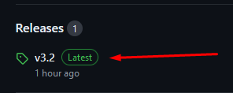

# Installation guide

### Prerequisites
#### 1) [CMake](https://cmake.org/) version at least 3.26.
#### 2) GCC or Clang version at least 10.
#### 3) To run on Linux the following libraries are required:
```
libxrandr-dev
libxcursor-dev
libudev-dev
libopenal-dev
libflac-dev
libvorbis-dev
libgl1-mesa-dev
libegl1-mesa-dev
libdrm-dev
libgbm-dev
libfreetype6-dev
```

<br>

### Step 1

Download the source code as ZIP from [here](https://github.com/Bogdanctx/Radar-Contact) by presing the
green button marked in the image below.



### Step 2

Press <b>Download ZIP</b> button and then extract the content.


### Step 3

Go inside the extracted folder (the folder name should be Radar-Contact-main)


### Step 4

Open your OS terminal inside the extracted folder and type the following 
command: ```cmake -S . -B build```. Then wait until the whole
process is finished (it may take a while).


### Step 5

After the previous step finished type the following command 
in terminal: ```cmake --build build -j6``` (```--j6``` is the number of
threads used to build the project - this is used to make the process faster).


### Step 6

Install the build with this command: ```cmake --install build```


### Step 7

To run the game on <b>Windows</b> use ```start ./install_dir/bin/radar_contact.exe``` <br>

<br><br>
To run the game on <b>Linux / macOS</b> use ```./install_dir/bin/radar_contact``` <br>


### Possible errors on macOS


1) ```dyld[]: Library not loaded: @rpath/../Frameworks/freetype.framework/Versions/A/freetype```
#### Fix: Run the following command inside <b>radar-contact-main</b> directory ```sudo cp -r ./build/_deps/sfml-src/extlibs/libs-osx/frameworks/ /library/frameworks```. 

This error is because of <b>FLAC</b>, <b>freetype</b>, <b>ogg</b>, <b>OpenAL</b>, <b>vorbis</b>, <b>vorbisenc</b> and 
<b>vorbisfile</b> frameworks missing, so this command will copy them to ```/library/frameworks```.

