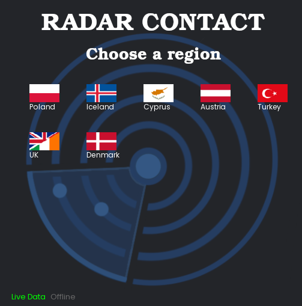
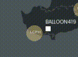
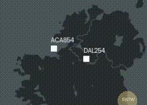
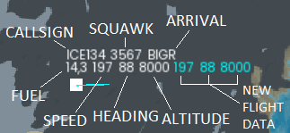

## Download

Click on the latest tag available in <b>Releases</b> tab, then select the version (Windows, Ubuntu, macOS) that match your specifications. 

## How to play?

Run the game and select a region. Available regions: <b>Poland, Iceland, Cyprus, Austria, Turkey, UK & Ireland, Denmark,
France, Spain & Portugal, Greece</b>.

In case of a missing network connection or if you prefer <b>not to download live data</b>, you can play in <b>Offline mode</b> using 
local data. To achieve this, press the <b>Offline</b> button.

After that, control your airspace! Avoid storms and give instructions to airplanes, helicopters and hot air balloons to arrive to their airport.

An airplane will disconnect from your frequency when it is <b>inside the arrival airport coverage area</b> (the yellow circle)
and if its <b>altitude is below 10.000ft</b> and <b>airspeed below 250 knots</b>.

## Collisions!
Be careful! If 2 flying entities are at the same altitude they'll collide!

## Data of a flying entity

The <b>blue text</b> indicates the flight data (<b>airspeed, heading, altitude</b>) that you have modified. When 
you adjust the <b>airspeed, heading, or altitude</b> of an airplane, the corresponding <b>blue text will update</b> to reflect the changes you made. 
As a result, <b>the airplane's current data will adjust according to these modifications</b>.

## Keybinds

Change <b>heading</b> by pressing <b>LSHIFT</b> and <b>move your cursor around</b>.

Change <b>altitude</b> by pressing <b>LALT</b> and <b>UP / DOWN arrow</b>.

Change <b>airspeed</b> by pressing <b>LCTRL</b> and <b>UP / DOWN arrow</b>.

Add a waypoint to an aircraft route by pressing the <b>SPACE</b> key.

Hide / show <b>flights table</b> by pressing <b>R</b>.

Hide / show <b>waypoints</b> by pressing <b>T</b>.

To go <b>back to menu</b> press <b>Enter</b>. 

## Resources

- [SFML](https://github.com/SFML/SFML/tree/2.6.1)
- [AIRPLANES.LIVE](https://airplanes.live/get-started/) (Live air traffic)
- [RainViewer](https://www.rainviewer.com/api.html) (Weather API)
- [Pixabay](https://pixabay.com/sound-effects/search/air-traffic-control/) (ATC voice sound)
- [Pixabay](https://pixabay.com/sound-effects/search/landing/) (Loading screen landing sound)

## Update [21 July 2024]

### New critical scenarios ahead!

Your job just got even more demanding. In addition to <b>weather
control</b>, you now need to manage <b>emergencies</b> like <b>hijacking, lost communications
or a general emergency</b>.

 

During a <b>hijacking, communication with the cockpit will be compromised</b>. 
The airplane will <b>fly by itself, ignoring your instructions</b>, which could 
lead to a <b>collision with another airplane</b>.

  

During a <b>lost communications</b> emergency, the pilots will 
<b>attempt to restore contact</b> with you. This will be the <b>only time</b>
you can <b>give instructions to that airplane</b>.

  

Additionally, airplanes and helicopters have <b>fuel consumption</b>. 
You must manage them <b>efficiently and fast</b> to ensure they reach their 
destination airports before they <b>run out</b>, <b>preventing a crash</b>. The airplane
will crash if speed is <b>below 140 knots</b> (the minimum speed) or <b>altitude is below 0</b> and
fuel <b>quantity is below 2.0kgs</b>.

When they run out of fuel, the airplane 
will <b>still listen to your instructions</b>.

### <b>Good luck and stay vigilant!</b>

## Update [18 July 2024]

### Stability Fixes and Quality Enhancements

 <ul>
      <li>Fixed Iceland crash when playing in offline mode.</li>
      <li>Fixed a bug that caused an airplane to move faster when it was repeatedly clicked on in flight table.</li>
      <li>Fixed airplanes callsign position.</li>
      <li>Fix for Cyprus air traffic.</li>
      <li>Added icon for game window.</li>
      <li>Removed console for Windows users.</li>
      <li>Lowered volume of loading screen and ATC voice.</li>
      <li>Other minor changes and optimizations.</li>
  </ul>

## Update [17 July 2024]

### Attention all Air Traffic Controllers!

From now on, your job just got even more realistic with <b>real air traffic integration</b>,
thanks to <b>[AIRPLANES.LIVE](https://airplanes.live/get-started/)</b>.

## Update [13 July 2024]

### Ladies and gentlemen, fasten your seatbelts!

Your job as an ATC just got tougher. Control airplanes to ensure they avoid storms. 
Once inside bad weather, airplanes will rapidly lose altitude, their airspeed will decrease, and their heading will become unstable.

## Update [9 July 2024]

### Routes!
To create a route for a flying entity, click on the flying entity, then press <b>Space</b> on any waypoint 
available on the map to add it to the current route. To reset the route, change the heading.

