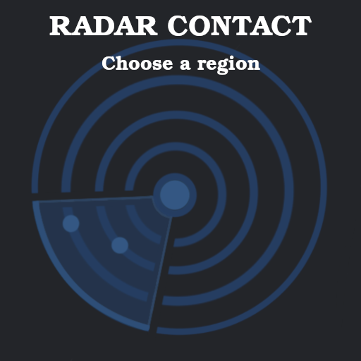

# Radar Contact

### Download

Click on the latest tag available in <b>Releases</b> tab, then select the version (Windows, Ubuntu, macOS) that match your specifications. 

### How to play?

Run the game and choose a region. Available regions: Poland, Iceland, Cyprus, Austria, Turkey, UK & Ireland.

In case of a missing network connection or if you prefer not to download live data, you can play in Offline mode using 
local data. To achieve this, press the "Offline" button.

After that, control your airspace! Give instructions to airplanes, helicopters and hot air balloons to arrive to their airports.

A flying entity will disconnect from your frequency when it is inside the arrival airport coverage area (the yellow circles). In order to disconnect, some conditions are required: altitude must be below 10000ft and the airspeed must be below 250 knots.

# Collisions!
Be careful! If 2 flying entities are at the same altitude they'll collide!

# Data of a flying entity

Blue text represents new flight data, if any has been given. 

# Controls

Change <b>heading</b> by pressing <b>LSHIFT</b> and <b>move your cursor around</b>.

Change <b>altitude</b> by pressing <b>LALT</b> and <b>UP / DOWN arrow</b>.

Change <b>airspeed</b> by pressing <b>LCTRL</b> and <b>UP / DOWN arrow</b>.

Hide / show <b>flights table</b> by pressing <b>R</b>.

Hide / show <b>waypoints</b> by pressing <b>T</b>.

To go <b>back to menu</b> press <b>Enter</b>. 

# Update [9 July 2024]

### Routes!
To create a route for a flying entity, click on the flying entity, then press <b>Space</b> on any waypoint 
available on the map to add it to the current route. To reset the route, change the heading.

## Resources

- [SFML](https://github.com/SFML/SFML/tree/2.6.1) (Zlib)
- [RainViewer](https://www.rainviewer.com/) (Weather API)
- [VATSIM](https://vatsim.dev/) (Airplanes API)
- [Google Fonts](https://fonts.google.com/specimen/Poppins) (Poppins)
- [Google Fonts](https://fonts.google.com/specimen/Raleway?query=raleway) (Raleway)
- [Flaticon](https://www.flaticon.com/free-icon/radar_15721478?term=radar&page=1&position=33&origin=tag&related_id=15721478) (Radar icon)
- [Pixabay](https://pixabay.com/sound-effects/search/air-traffic-control/) (ATC)
- [Pixabay](https://pixabay.com/sound-effects/search/landing/) (Landing sound)
- [Flightradar24](https://www.flightradar24.com) (Map images)
