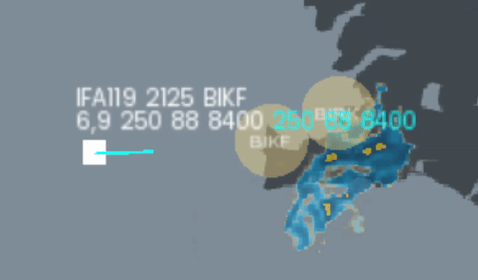

## Download

Click on the [latest version](https://github.com/Bogdanctx/Radar-Contact/releases/tag/v3.2) available in the [Releases](https://github.com/Bogdanctx/Radar-Contact/releases) tab and 
download either [Windows](https://github.com/Bogdanctx/Radar-Contact/releases/download/v3.2/Radar-Contact_windows.zip) or [Ubuntu](https://github.com/Bogdanctx/Radar-Contact/releases/download/v3.2/Radar-Contact_ubuntu-22.04.zip) version.

#### => Playing on Ubuntu-22.04 requires GCC 12. Please read the <i>[Common errors on Linux](https://github.com/Bogdanctx/Radar-Contact/blob/main/INSTALLATION.md#common-errors-on-linux)</i> section of the [installation guide](./INSTALLATION.md).
#### => Playing on Windows requires [Microsoft Visual C++](https://learn.microsoft.com/en-us/cpp/windows/latest-supported-vc-redist?view=msvc-170#latest-microsoft-visual-c-redistributable-version).

 

#### If you're playing on an unsupported OS (e.g. macOS) you have to build the project on your PC. To do this follow [this tutorial](./INSTALLATION.md).

## Updates
#### Check [changelog](./CHANGELOG.md) for the latest updates.

## How to play?

Run the game and select a region. Available regions: <b>Poland, Iceland, Cyprus, Austria, Turkey, UK & Ireland, Denmark,
France, Spain & Portugal, Greece</b>.

In case of a missing network connection or if you prefer <b>not to download live data</b>, you can play in <b>Offline mode</b> using 
local data. To achieve this, press the <b>Offline</b> button.

After that, control your airspace! Avoid storms and give instructions to airplanes and helicopters to arrive to their airport.

An airplane will disconnect from your frequency when it is <b>inside the arrival airport coverage area</b> (the yellow circle)
and if its <b>altitude is below 10.000ft</b> and <b>airspeed below 250 knots</b>.

## Collisions!
Be careful! If 2 flying entities are at the same altitude they'll collide!

## Data of a flying entity

The <b>blue text</b> indicates the flight data (<b>airspeed, heading, altitude</b>) that you have modified. When 
you adjust the <b>airspeed, heading, or altitude</b> of an airplane, the corresponding <b>blue text will update</b> to reflect the changes you made. 
As a result, <b>the airplane's current data will adjust according to these modifications</b>.

## Keybinds

To select an airplane press <b>Left Click</b>.

Change <b>heading</b> by pressing <b>LSHIFT</b> and <b>move your cursor around</b>.

Change <b>altitude</b> by pressing <b>LALT</b> and <b>UP / DOWN arrow</b>.

Change <b>airspeed</b> by pressing <b>LCTRL</b> and <b>UP / DOWN arrow</b>.

Add a waypoint to an aircraft route by pressing the <b>SPACE</b> key.

Hide / show <b>flights table</b> by pressing <b>R</b>.

Hide / show <b>waypoints</b> by pressing <b>T</b>.

To go <b>back to menu</b> press <b>Enter</b>.

## Resources

- [SFML](https://github.com/SFML/SFML/tree/2.6.1)
- [AIRPLANES.LIVE](https://airplanes.live/get-started/) (Live air traffic)
- [RainViewer](https://www.rainviewer.com/api.html) (Weather API)
- [Pixabay](https://pixabay.com/sound-effects/search/air-traffic-control/) (ATC voice sound)
- [Pixabay](https://pixabay.com/sound-effects/search/landing/) (Loading screen landing sound)
